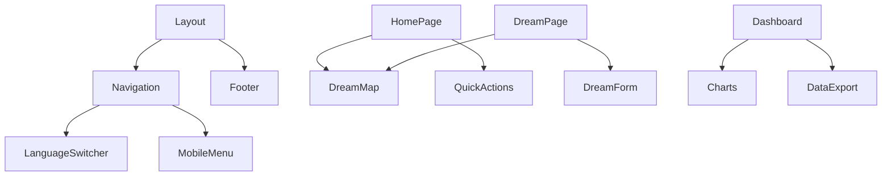

# Platform Architecture Refactor Documentation
## Back-on-Track Pajama Party Platform - Production Ready Structure

**Document Version:** 1.0  
**Date:** 2025-08-21  
**Author:** Platform Architecture Team  
**Status:** Planning Phase

---

## Executive Summary

This document outlines the comprehensive refactoring plan to transform the current single-page application into a properly structured multi-page platform with clear navigation, content separation, and production-ready architecture for the September 26th, 2025 European Pajama Party event.

---

## 1. Current State Analysis

### 1.1 Problems Identified

#### Structural Issues
- **Single Page Overload**: Everything crammed into homepage (`app/page.tsx`)
- **Poor Navigation**: Only floating nav with anchor links (#hero, #map, #community, #about)
- **Content Mixing**: Multiple unrelated features on same page
- **User Journey Confusion**: 6-phase journey mixed with other content
- **Mobile Issues**: Responsive design breaks on smaller screens

#### Technical Debt
- Missing pages (/privacy, /terms, /resources)
- Hardcoded fallback data in components
- Unverified external links
- No proper routing between tools

#### User Experience Problems
- Cannot directly access specific tools
- Long scroll to find features
- No clear entry points for different user types
- Confusing mix of activism, data collection, and community features

### 1.2 Existing Assets

#### Pages That Work
- `/interview` - Well-structured QR interview mode
- `/impact` - Clear dashboard presentation
- `/dream/[placeId]` - Good individual destination pages
- `/participate` - Functional event sign-up

#### Components to Reuse
- `DreamMap` - Core visualization
- `DreamForm` - Submission interface
- `DreamCounter` - Live statistics
- Dashboard components suite
- Interview mode components

#### Strong Features
- Multilingual support infrastructure
- Offline capability
- Real-time updates
- Mobile-responsive components (need better layout)

---

## 2. Proposed Architecture

### 2.1 Site Structure

```
pajama-party-platform/
│
├── Public Pages
│   ├── / (Homepage - Map focused)
│   ├── /about (Platform & Back-on-Track info)
│   ├── /privacy (Data handling)
│   └── /terms (Terms of use)
│
├── Core Tools
│   ├── /dream (Dream submission form)
│   ├── /interview (QR interview mode)
│   ├── /dashboard (Public impact data)
│   └── /resources (Downloads & kits)
│
├── Event Pages
│   ├── /pajama-party (Event information)
│   ├── /participate (Join the event)
│   └── /organize (Become organizer)
│
├── Community
│   ├── /community (Hub & stats)
│   └── /connect/[placeId] (Route planning)
│
└── Utility Pages
    ├── /404 (Not found)
    └── /offline (PWA offline)
```

### 2.2 Navigation Architecture

#### Primary Navigation Bar
```typescript
interface NavItem {
  label: string;
  href: string;
  icon?: string;
  children?: NavItem[];
}

const navigation: NavItem[] = [
  { label: 'Home', href: '/' },
  { label: 'Dream', href: '/dream' },
  { label: 'Interview', href: '/interview' },
  { label: 'Dashboard', href: '/dashboard' },
  { 
    label: 'Event',
    href: '/pajama-party',
    children: [
      { label: 'About Event', href: '/pajama-party' },
      { label: 'Participate', href: '/participate' },
      { label: 'Organize', href: '/organize' }
    ]
  },
  { label: 'Resources', href: '/resources' },
  { label: 'About', href: '/about' }
];
```

#### Mobile Navigation
- Hamburger menu (top-right)
- Full-screen overlay
- Touch targets: minimum 44x44px
- Optional bottom navigation for key actions

### 2.3 Page Content Distribution

#### Homepage (/)
```markdown
- Hero Section
  - Title: "European Night Train Dreams"
  - Subtitle: Back-on-Track Action Group Initiative
  - Primary CTA: "Share Your Dream Route"
  
- Map Section
  - Full-width interactive map
  - Dream counter overlay
  - Layer toggle (Dreams/Reality)
  - Export tools
  
- Quick Actions (3 cards)
  - Dream: Submit your route
  - Interview: Volunteer mode
  - Dashboard: View impact
  
- Footer
  - Partners placeholder
  - Quick links
  - Social media
```

#### Dream Page (/dream)
```markdown
- Page Header
  - Title: "Share Your Dream Night Train Route"
  - Progress indicator
  
- Main Content
  - Dream submission form
  - Map preview
  - Climate impact info
  
- Success State
  - Thank you message
  - Next steps
  - Share options
```

#### Interview Page (/interview)
```markdown
- Volunteer Mode Toggle
- Language Selector (EN/DE/FR)
- Quick Dream Form
- Session Statistics
- Offline Queue Status
```

#### Dashboard Page (/dashboard)
```markdown
- Public Statistics
  - Dream counter
  - Growth chart
  - Popular routes
  - Station readiness
  
- Export Tools
  - CSV/JSON download
  - API documentation
  
- Advocacy Section
  - Use cases
  - Media kit link
```

---

## 3. Implementation Plan

### 3.1 Phase 1: Navigation Infrastructure (Day 1)

#### Tasks:
1. **Create Navigation Component**
   ```typescript
   // src/components/layout/Navigation.tsx
   - Desktop navigation bar
   - Mobile hamburger menu
   - Active page highlighting
   - Language switcher
   ```

2. **Update Layout**
   ```typescript
   // app/layout.tsx
   - Replace FloatingNav with Navigation
   - Add consistent header/footer
   - Implement breadcrumbs provider
   ```

3. **Add Routing Utilities**
   ```typescript
   // src/lib/navigation.ts
   - Route definitions
   - Active route detection
   - Breadcrumb generation
   ```

### 3.2 Phase 2: Homepage Refactor (Day 1-2)

#### Tasks:
1. **Simplify Homepage**
   - Remove all scrolling sections
   - Keep only: Hero, Map, Quick Actions
   - Move long content to appropriate pages

2. **Extract Components**
   - Move 6-phase journey to `/about`
   - Move testimonials to `/community`
   - Move detailed info to `/resources`

3. **Optimize Performance**
   - Lazy load below-fold content
   - Optimize map initialization
   - Reduce initial bundle size

### 3.3 Phase 3: Page Creation & Migration (Day 2-3)

#### New Pages to Create:

1. **Resources Page** (`/resources`)
   ```typescript
   - Pajama Party Kit download
   - Organizer guidelines
   - Media assets
   - Technical documentation
   ```

2. **About Page** (`/about`)
   ```typescript
   - Back-on-Track mission
   - 6-phase journey explanation
   - Team & partners
   - Contact information
   ```

3. **Privacy Page** (`/privacy`)
   ```typescript
   - Data collection practices
   - Analytics transparency
   - GDPR compliance
   - Data retention policies
   ```

4. **Terms Page** (`/terms`)
   ```typescript
   - Terms of service
   - User agreements
   - License information
   ```

### 3.4 Phase 4: Mobile Optimization (Day 3)

#### Tasks:
1. **Responsive Navigation**
   - Test hamburger menu
   - Ensure touch-friendly targets
   - Fix landscape orientation issues

2. **Page Layouts**
   - Stack columns on mobile
   - Optimize map for small screens
   - Simplify forms for mobile

3. **Performance**
   - Reduce JavaScript for mobile
   - Optimize images
   - Test on 3G connections

### 3.5 Phase 5: Internationalization (Day 4)

#### Setup i18n:
```typescript
// src/lib/i18n/config.ts
export const languages = ['en', 'de', 'fr'];
export const defaultLanguage = 'en';

// Translations structure
locales/
├── en/
│   ├── common.json
│   ├── navigation.json
│   └── pages.json
├── de/
│   └── ...
└── fr/
    └── ...
```

#### Implementation:
1. Install next-i18next
2. Configure language routing
3. Add language switcher to navigation
4. Translate key content

### 3.6 Phase 6: Testing & Polish (Day 4-5)

#### Testing Checklist:
- [ ] All pages accessible
- [ ] Navigation works on all devices
- [ ] Forms submit correctly
- [ ] Map loads properly
- [ ] Offline mode works
- [ ] Language switching works
- [ ] Analytics tracking active
- [ ] Performance metrics met

---

## 4. Technical Implementation Details

### 4.1 Navigation Component Structure

```typescript
// src/components/layout/Navigation.tsx
interface NavigationProps {
  currentPath: string;
  language: string;
  onLanguageChange: (lang: string) => void;
}

export function Navigation({ currentPath, language, onLanguageChange }: NavigationProps) {
  const [mobileMenuOpen, setMobileMenuOpen] = useState(false);
  
  return (
    <>
      {/* Desktop Navigation */}
      <nav className="hidden lg:flex">
        {/* Navigation items */}
      </nav>
      
      {/* Mobile Navigation */}
      <div className="lg:hidden">
        {/* Hamburger button */}
        {/* Mobile menu overlay */}
      </div>
    </>
  );
}
```

### 4.2 Route Configuration

```typescript
// src/config/routes.ts
export const routes = {
  home: '/',
  dream: '/dream',
  interview: '/interview',
  dashboard: '/dashboard',
  pajamaParty: '/pajama-party',
  participate: '/participate',
  organize: '/organize',
  community: '/community',
  resources: '/resources',
  about: '/about',
  privacy: '/privacy',
  terms: '/terms',
} as const;

export type Route = typeof routes[keyof typeof routes];
```

### 4.3 Page Template Structure

```typescript
// Template for new pages
import { Navigation } from '@/components/layout/Navigation';
import { Footer } from '@/components/layout/Footer';
import { useTranslation } from 'next-i18next';

export default function PageTemplate() {
  const { t } = useTranslation('common');
  
  return (
    <>
      <Navigation />
      <main className="min-h-screen">
        <div className="container mx-auto px-4 py-8">
          {/* Page content */}
        </div>
      </main>
      <Footer />
    </>
  );
}
```

### 4.4 Mobile-First CSS Strategy

```css
/* Mobile first approach */
.container {
  /* Mobile styles (default) */
  padding: 1rem;
}

@media (min-width: 640px) {
  /* Tablet styles */
  .container {
    padding: 1.5rem;
  }
}

@media (min-width: 1024px) {
  /* Desktop styles */
  .container {
    padding: 2rem;
    max-width: 1280px;
  }
}
```

---

## 5. User Flow Diagrams

### 5.1 Primary User Flows

#### Flow A: Dream Submission
```
Homepage → Dream Page → Form Completion → Success → Resources
         ↓
    (Map Interaction)
```

#### Flow B: Event Participation
```
Homepage → Pajama Party → Participate → Station Selection → Success
                        ↓
                    Organize (optional)
```

#### Flow C: Volunteer Interview
```
QR Code → Interview Page → Language Selection → Quick Form → Submit
                         ↓
                 Volunteer Dashboard
```

#### Flow D: Data Exploration
```
Homepage → Dashboard → View Stats → Export Data
         ↓
    Impact Metrics
```

### 5.2 Navigation Hierarchy

```
Level 1: Primary Navigation (Always visible)
├── Home
├── Dream
├── Interview
├── Dashboard
├── Event (dropdown)
├── Resources
└── About

Level 2: Contextual Navigation (Page specific)
├── Breadcrumbs
├── Section anchors
└── Related links

Level 3: Footer Navigation (Utility)
├── Privacy
├── Terms
├── Contact
└── Social links
```

---

## 6. Component Migration Map

### Components to Move/Refactor

| Current Location | Component | New Location | Notes |
|-----------------|-----------|--------------|-------|
| Homepage | 6-Phase Journey | /about | Extract as standalone section |
| Homepage | Testimonials | /community | Part of community showcase |
| Homepage | Long form content | /resources | Educational materials |
| Homepage | Event details | /pajama-party | Dedicated event page |
| Multiple | PhaseNavigation | Remove or simplify | Confuses main navigation |
| Multiple | UniversalMessage | Standardize | Use consistent messaging |

### New Components Needed

| Component | Purpose | Location |
|-----------|---------|----------|
| Navigation | Main site navigation | /components/layout |
| MobileMenu | Mobile navigation overlay | /components/layout |
| Breadcrumbs | Page hierarchy indicator | /components/layout |
| LanguageSwitcher | i18n selector | /components/layout |
| ResourceCard | Download items | /components/resources |
| PartnerLogo | Partner display | /components/about |

---

## 7. Performance Optimization Strategy

### 7.1 Bundle Size Optimization
- Split routes with dynamic imports
- Lazy load heavy components (map, charts)
- Tree-shake unused code
- Optimize images with next/image

### 7.2 Loading Strategy
```typescript
// Progressive enhancement
1. Critical CSS inline
2. Navigation + Hero (above fold)
3. Interactive elements (forms, map)
4. Analytics & monitoring
5. Nice-to-have features
```

### 7.3 Mobile Performance
- Reduce JavaScript payload
- Optimize for 3G connections
- Use CSS animations over JS
- Implement virtual scrolling for lists

---

## 8. SEO & Analytics Strategy

### 8.1 SEO Optimization
- Unique meta tags per page
- Structured data markup
- XML sitemap generation
- Open Graph optimization

### 8.2 Analytics Events
```typescript
// Key events to track
- page_view (all pages)
- dream_submission
- participation_signup
- interview_completion
- data_export
- resource_download
```

---

## 9. Deployment Checklist

### Pre-deployment
- [ ] All pages tested on mobile
- [ ] Navigation works without JavaScript
- [ ] Forms have proper validation
- [ ] Analytics configured
- [ ] SEO meta tags set
- [ ] Performance budget met (<3s load)
- [ ] Accessibility scan passed
- [ ] Cross-browser testing complete

### Vercel Configuration
```json
{
  "buildCommand": "npm run build",
  "outputDirectory": ".next",
  "framework": "nextjs",
  "regions": ["fra1"],
  "functions": {
    "app/api/interview/submit/route.ts": {
      "maxDuration": 10
    }
  }
}
```

---

## 10. Timeline & Milestones

### Week 1 (Aug 22-28)
- **Day 1-2**: Navigation infrastructure & homepage refactor
- **Day 3-4**: Page creation & content migration
- **Day 5**: Mobile optimization & testing

### Week 2 (Aug 29-Sep 4)
- **Day 1-2**: Internationalization setup
- **Day 3-4**: Testing & bug fixes
- **Day 5**: Performance optimization

### Week 3 (Sep 5-11)
- **Day 1-2**: Final polish & adjustments
- **Day 3-4**: Load testing & monitoring setup
- **Day 5**: Deployment preparation

### September 26 Ready
- Platform fully operational
- All features accessible
- Mobile optimized
- Multi-language support
- Performance optimized
- Analytics active

---

## Appendix A: File Structure

```
app/
├── (public)/
│   ├── page.tsx                 # Homepage
│   ├── about/page.tsx           # About page
│   ├── privacy/page.tsx         # Privacy policy
│   └── terms/page.tsx           # Terms of service
├── (tools)/
│   ├── dream/page.tsx           # Dream submission
│   ├── interview/page.tsx       # Interview mode
│   ├── dashboard/page.tsx       # Impact dashboard
│   └── resources/page.tsx       # Downloads
├── (event)/
│   ├── pajama-party/page.tsx    # Event info
│   ├── participate/page.tsx     # Join event
│   └── organize/page.tsx        # Organize
├── (community)/
│   ├── community/page.tsx       # Community hub
│   └── connect/[placeId]/page.tsx # Routes
└── layout.tsx                    # Root layout with nav

components/
├── layout/
│   ├── Navigation.tsx            # Main navigation
│   ├── MobileMenu.tsx           # Mobile menu
│   ├── Footer.tsx               # Site footer
│   └── Breadcrumbs.tsx         # Breadcrumb nav
├── forms/
│   ├── DreamForm.tsx            # Dream submission
│   └── ParticipationForm.tsx   # Event signup
└── [existing components...]

lib/
├── i18n/
│   ├── config.ts                # i18n configuration
│   └── translations/            # Translation files
├── navigation/
│   ├── routes.ts                # Route definitions
│   └── utils.ts                 # Navigation utilities
└── [existing utilities...]
```

---

## Appendix B: Component Dependencies



---

## Conclusion

This architecture refactor will transform the platform from a confusing single-page application into a well-structured, professional web platform ready for the September 26th European Pajama Party event. The new structure provides:

1. **Clear Navigation** - Users can find any feature in 2 clicks
2. **Content Separation** - Each tool has its dedicated space
3. **Mobile Optimization** - Works perfectly on all devices
4. **Scalability** - Easy to add new features
5. **Performance** - Fast loading, optimized bundles
6. **Accessibility** - WCAG compliant navigation
7. **Internationalization** - Multi-language ready

The phased implementation approach ensures we can deliver incrementally while maintaining platform stability throughout the refactoring process.

---

**Document Status**: Ready for Implementation  
**Next Steps**: Begin Phase 1 - Navigation Infrastructure  
**Target Completion**: September 5, 2025